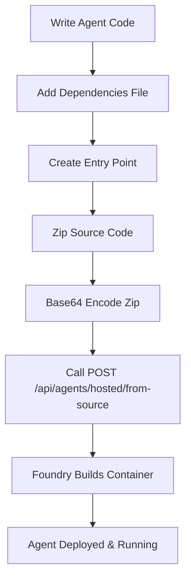

# Deploying Hosted Agents from Source Code

This guide explains how to deploy hosted agents in Azure AI Foundry directly from source code, without needing to build and push container images manually. This is a newer feature that simplifies the deployment process significantly.

## Table of Contents

- [Overview](#overview)
- [Prerequisites](#prerequisites)
- [Supported Runtimes](#supported-runtimes)
- [Deployment Workflow](#deployment-workflow)
- [Step-by-Step Guide](#step-by-step-guide)
  - [1. Prepare Your Agent Code](#1-prepare-your-agent-code)
  - [2. Package Your Code](#2-package-your-code)
  - [3. Deploy Using the API](#3-deploy-using-the-api)
- [Complete Examples](#complete-examples)
  - [Python Agent Example](#python-agent-example)
  - [.NET Agent Example](#net-agent-example)
- [Adapting for Other Codebases](#adapting-for-other-codebases)
- [Troubleshooting](#troubleshooting)
- [Best Practices](#best-practices)

---

## Overview

The **source code deployment** feature allows you to:

- Deploy agents directly from Python or .NET source code
- Skip manual container image building and registry management
- Automatically resolve dependencies during deployment
- Update agents by simply uploading new source code versions

The Azure AI Foundry service handles:
- Building the container image from your source code
- Installing dependencies (from requirements.txt, .csproj, etc.)
- Running your entry point within the containerized environment
- Managing the agent lifecycle and scaling

---

## Prerequisites

Before deploying from source code, ensure you have:

1. **Azure AI Foundry Project**
   - Active Azure subscription
   - Azure AI Foundry project created ([create one here](https://ai.azure.com))
   - Project endpoint URL (e.g., `https://your-project.services.ai.azure.com`)

2. **Authentication**
   - Azure CLI installed and logged in (`az login`)
   - Or Service Principal credentials with appropriate permissions
   - Required role: `Azure AI Developer` or `Contributor` on the Foundry project

3. **Development Tools**
   - For Python: Python 3.13+ and pip
   - For .NET: .NET 10 SDK
   - zip utility or equivalent for packaging

4. **This API Running**
   - The AzureAIFoundryApi service running locally or deployed
   - Project endpoint configured in `appsettings.json`

---

## Supported Runtimes

The following runtimes are currently supported:

| Runtime | Version | Entry Point Example | Notes |
|---------|---------|---------------------|-------|
| `python_3_13` | Python 3.13 | `main.py` | Default runtime, best tested |
| `python_3_14` | Python 3.14 | `main.py` | Latest Python version |
| `dotnet_10` | .NET 10 | `MyAgent.dll` | .NET runtime |

**Important:** Ensure your packaged code contains binaries and dependencies compatible with Linux (since agents run in Linux containers).

---

## Deployment Workflow



---

## Step-by-Step Guide

### 1. Prepare Your Agent Code

Your agent code should:
- Implement the required protocol (A2A, OpenAI, etc.)
- Have a clear entry point (main file or executable)
- Include all dependencies specified in a manifest file

**For Python:**
```
my-agent/
├── main.py                 # Entry point
├── requirements.txt        # Dependencies
├── agent_logic/
│   ├── __init__.py
│   └── handlers.py
└── config.yaml            # Optional config
```

**For .NET:**
```
my-agent/
├── MyAgent.csproj         # Project file with dependencies
├── Program.cs             # Entry point
├── AgentHandlers.cs
└── appsettings.json       # Optional config
```

### 2. Package Your Code

#### Python Example

```bash
# Navigate to your agent directory
cd my-agent/

# Create a zip file containing all source files
zip -r agent-source.zip . -x "*.pyc" -x "__pycache__/*" -x "*.git/*"

# Verify the zip contents
unzip -l agent-source.zip
```

#### .NET Example

```bash
# Build your project for Linux (required for Foundry)
dotnet publish -c Release -r linux-x64 --self-contained false -o ./publish

# Navigate to the publish directory
cd publish/

# Create a zip file
zip -r ../agent-source.zip .

cd ..
```

#### Convert to Base64

```bash
# On Linux/macOS
base64 -i agent-source.zip -o agent-source-base64.txt

# On Windows PowerShell
[Convert]::ToBase64String([IO.File]::ReadAllBytes("agent-source.zip")) | Out-File -FilePath agent-source-base64.txt
```

### 3. Deploy Using the API

Create a JSON request payload (see `SamplePayloads/Agents/POST_hosted_from_source.json`):

```json
{
  "agentName": "my-custom-agent",
  "sourceCodeZipBase64": "<paste-base64-content-here>",
  "runtime": "python_3_13",
  "entryPoint": "main.py",
  "cpu": "2",
  "memory": "4Gi",
  "protocolVersions": [
    { "protocol": "A2A", "version": "0.2.1" }
  ],
  "environmentVariables": {
    "APP_ENV": "production",
    "LOG_LEVEL": "info"
  },
  "buildCommand": "pip install -r requirements.txt",
  "description": "My custom agent deployed from source"
}
```

Deploy using curl:

```bash
curl -X POST 'https://localhost:5001/api/agents/hosted/from-source?projectEndpoint=https://your-project.services.ai.azure.com' \
  -H 'Content-Type: application/json' \
  -d @deploy-request.json
```

**Response:**
```json
{
  "id": "agent_abc123",
  "name": "my-custom-agent",
  "version": "1"
}
```

---

## Complete Examples

### Python Agent Example

**Directory Structure:**
```
customer-service-agent/
├── main.py
├── requirements.txt
├── agent/
│   ├── __init__.py
│   ├── handlers.py
│   └── utils.py
└── README.md
```

**main.py:**
```python
"""
Customer Service Agent Entry Point
Implements the A2A protocol for Azure AI Foundry
"""
import os
import json
from agent.handlers import handle_customer_query

def main():
    # Agent initialization
    print("Starting Customer Service Agent...")
    
    # The Foundry runtime will call this agent via the A2A protocol
    # Your code should implement the protocol handlers
    
    # Example: Listen for incoming requests
    while True:
        # Protocol-specific message handling
        pass

if __name__ == "__main__":
    main()
```

**requirements.txt:**
```
azure-identity>=1.15.0
azure-ai-projects>=2.0.0
openai>=1.0.0
pydantic>=2.0.0
```

**Package and Deploy:**
```bash
# Package
zip -r customer-service-agent.zip . -x "*.pyc" -x "__pycache__/*"

# Convert to base64
base64 -i customer-service-agent.zip -o source-base64.txt

# Create deployment request (update the JSON with base64 content)
cat > deploy.json <<EOF
{
  "agentName": "customer-service-agent",
  "sourceCodeZipBase64": "$(cat source-base64.txt)",
  "runtime": "python_3_13",
  "entryPoint": "main.py",
  "cpu": "2",
  "memory": "4Gi",
  "protocolVersions": [
    { "protocol": "A2A", "version": "0.2.1" }
  ],
  "environmentVariables": {
    "APP_ENV": "production",
    "LOG_LEVEL": "info"
  },
  "buildCommand": "pip install -r requirements.txt",
  "description": "Customer service agent with AI-powered responses"
}
EOF

# Deploy
curl -X POST 'https://localhost:5001/api/agents/hosted/from-source?projectEndpoint=https://your-project.services.ai.azure.com' \
  -H 'Content-Type: application/json' \
  -d @deploy.json
```

### .NET Agent Example

**Project Structure:**
```
DataProcessorAgent/
├── DataProcessorAgent.csproj
├── Program.cs
├── AgentService.cs
├── Models/
│   └── DataModels.cs
└── appsettings.json
```

**Program.cs:**
```csharp
using Microsoft.Extensions.Hosting;
using Microsoft.Extensions.DependencyInjection;

var builder = Host.CreateApplicationBuilder(args);

// Configure services
builder.Services.AddHostedService<AgentService>();

var host = builder.Build();
await host.RunAsync();
```

**DataProcessorAgent.csproj:**
```xml
<Project Sdk="Microsoft.NET.Sdk">
  <PropertyGroup>
    <OutputType>Exe</OutputType>
    <TargetFramework>net10.0</TargetFramework>
    <RuntimeIdentifier>linux-x64</RuntimeIdentifier>
  </PropertyGroup>

  <ItemGroup>
    <PackageReference Include="Azure.AI.Projects" Version="2.0.0" />
    <PackageReference Include="Azure.Identity" Version="1.21.0" />
    <PackageReference Include="Microsoft.Extensions.Hosting" Version="10.0.0" />
  </ItemGroup>
</Project>
```

**Package and Deploy:**
```bash
# Build and publish for Linux
dotnet publish -c Release -r linux-x64 --self-contained false -o ./publish

# Package
cd publish
zip -r ../data-processor-agent.zip .
cd ..

# Convert to base64 (PowerShell on Windows)
$base64 = [Convert]::ToBase64String([IO.File]::ReadAllBytes("data-processor-agent.zip"))
$base64 | Out-File -FilePath source-base64.txt

# Create deployment JSON
@"
{
  "agentName": "data-processor-agent",
  "sourceCodeZipBase64": "$base64",
  "runtime": "dotnet_10",
  "entryPoint": "DataProcessorAgent.dll",
  "cpu": "2",
  "memory": "4Gi",
  "protocolVersions": [
    { "protocol": "A2A", "version": "0.2.1" }
  ],
  "environmentVariables": {
    "DOTNET_ENVIRONMENT": "Production"
  },
  "buildCommand": "dotnet restore",
  "description": ".NET data processing agent"
}
"@ | Out-File -FilePath deploy.json

# Deploy
Invoke-RestMethod -Method Post -Uri "https://localhost:5001/api/agents/hosted/from-source?projectEndpoint=https://your-project.services.ai.azure.com" -Headers @{"Content-Type"="application/json"} -InFile deploy.json
```

---

## Adapting for Other Codebases

To integrate this deployment pattern into your own projects:

### 1. Create a Deployment Script

**deploy-agent.sh (Bash):**
```bash
#!/bin/bash
set -e

# Configuration
AGENT_NAME="$1"
SOURCE_DIR="$2"
RUNTIME="$3"
ENTRY_POINT="$4"
PROJECT_ENDPOINT="${AZURE_FOUNDRY_ENDPOINT}"
API_URL="${FOUNDRY_API_URL:-https://localhost:5001}"

if [ -z "$AGENT_NAME" ] || [ -z "$SOURCE_DIR" ]; then
    echo "Usage: $0 <agent-name> <source-dir> <runtime> <entry-point>"
    echo "Example: $0 my-agent ./src python_3_13 main.py"
    exit 1
fi

echo "📦 Packaging agent from $SOURCE_DIR..."
cd "$SOURCE_DIR"
zip -r /tmp/"$AGENT_NAME".zip . -x "*.pyc" -x "__pycache__/*" -x "*.git/*" -x "node_modules/*"

echo "🔐 Encoding to base64..."
BASE64_CONTENT=$(base64 -i /tmp/"$AGENT_NAME".zip)

echo "🚀 Deploying to Azure AI Foundry..."
cat > /tmp/deploy-request.json <<EOF
{
  "agentName": "$AGENT_NAME",
  "sourceCodeZipBase64": "$BASE64_CONTENT",
  "runtime": "$RUNTIME",
  "entryPoint": "$ENTRY_POINT",
  "cpu": "2",
  "memory": "4Gi",
  "protocolVersions": [
    { "protocol": "A2A", "version": "0.2.1" }
  ],
  "description": "Deployed via automation script"
}
EOF

curl -X POST "$API_URL/api/agents/hosted/from-source?projectEndpoint=$PROJECT_ENDPOINT" \
  -H "Content-Type: application/json" \
  -d @/tmp/deploy-request.json

echo "✅ Deployment complete!"
```

**Usage:**
```bash
chmod +x deploy-agent.sh
export AZURE_FOUNDRY_ENDPOINT="https://your-project.services.ai.azure.com"
./deploy-agent.sh customer-service-agent ./my-agent python_3_13 main.py
```

### 2. CI/CD Integration

**GitHub Actions Example (.github/workflows/deploy-agent.yml):**
```yaml
name: Deploy Agent to Azure AI Foundry

on:
  push:
    branches: [main]
    paths:
      - 'agents/**'

jobs:
  deploy:
    runs-on: ubuntu-latest
    steps:
      - uses: actions/checkout@v4
      
      - name: Package Agent
        run: |
          cd agents/my-agent
          zip -r agent-source.zip . -x "*.pyc" -x "__pycache__/*"
      
      - name: Deploy to Foundry
        env:
          FOUNDRY_ENDPOINT: ${{ secrets.AZURE_FOUNDRY_ENDPOINT }}
          FOUNDRY_API_URL: ${{ secrets.FOUNDRY_API_URL }}
        run: |
          BASE64_CONTENT=$(base64 -w 0 agents/my-agent/agent-source.zip)
          
          cat > deploy.json <<EOF
          {
            "agentName": "my-agent",
            "sourceCodeZipBase64": "$BASE64_CONTENT",
            "runtime": "python_3_13",
            "entryPoint": "main.py",
            "cpu": "2",
            "memory": "4Gi",
            "protocolVersions": [
              { "protocol": "A2A", "version": "0.2.1" }
            ]
          }
          EOF
          
          curl -X POST "$FOUNDRY_API_URL/api/agents/hosted/from-source?projectEndpoint=$FOUNDRY_ENDPOINT" \
            -H "Content-Type: application/json" \
            -d @deploy.json
```

### 3. Python Helper Module

**agent_deployer.py:**
```python
"""
Helper module for deploying agents to Azure AI Foundry from source code
"""
import base64
import json
import zipfile
from pathlib import Path
from typing import Dict, List, Optional
import requests

class AgentDeployer:
    def __init__(self, api_url: str, project_endpoint: str):
        self.api_url = api_url
        self.project_endpoint = project_endpoint
    
    def package_directory(self, source_dir: Path, output_zip: Path) -> None:
        """Package a directory into a zip file"""
        with zipfile.ZipFile(output_zip, 'w', zipfile.ZIP_DEFLATED) as zipf:
            for file_path in source_dir.rglob('*'):
                if file_path.is_file() and not self._should_exclude(file_path):
                    arcname = file_path.relative_to(source_dir)
                    zipf.write(file_path, arcname)
    
    def _should_exclude(self, path: Path) -> bool:
        """Check if file should be excluded from zip"""
        excludes = ['__pycache__', '.pyc', '.git', 'node_modules', '.env']
        return any(ex in str(path) for ex in excludes)
    
    def deploy_from_source(
        self,
        agent_name: str,
        source_dir: Path,
        runtime: str,
        entry_point: str,
        cpu: str = "2",
        memory: str = "4Gi",
        env_vars: Optional[Dict[str, str]] = None,
        build_command: Optional[str] = None,
        description: Optional[str] = None
    ) -> Dict:
        """Deploy an agent from source directory"""
        
        # Package source code
        zip_path = Path(f"/tmp/{agent_name}.zip")
        self.package_directory(source_dir, zip_path)
        
        # Encode to base64
        with open(zip_path, 'rb') as f:
            zip_base64 = base64.b64encode(f.read()).decode('utf-8')
        
        # Prepare request
        payload = {
            "agentName": agent_name,
            "sourceCodeZipBase64": zip_base64,
            "runtime": runtime,
            "entryPoint": entry_point,
            "cpu": cpu,
            "memory": memory,
            "protocolVersions": [
                {"protocol": "A2A", "version": "0.2.1"}
            ],
            "environmentVariables": env_vars or {},
            "description": description or f"Deployed from {source_dir}"
        }
        
        if build_command:
            payload["buildCommand"] = build_command
        
        # Deploy
        url = f"{self.api_url}/api/agents/hosted/from-source"
        params = {"projectEndpoint": self.project_endpoint}
        
        response = requests.post(url, json=payload, params=params)
        response.raise_for_status()
        
        return response.json()

# Usage example:
if __name__ == "__main__":
    deployer = AgentDeployer(
        api_url="https://localhost:5001",
        project_endpoint="https://your-project.services.ai.azure.com"
    )
    
    result = deployer.deploy_from_source(
        agent_name="my-python-agent",
        source_dir=Path("./my-agent"),
        runtime="python_3_13",
        entry_point="main.py",
        env_vars={"LOG_LEVEL": "info"},
        build_command="pip install -r requirements.txt",
        description="My Python agent"
    )
    
    print(f"Deployed agent: {result}")
```

---

## Troubleshooting

### Common Issues

**1. Base64 encoding errors**
```
Error: "Invalid base64-encoded source code zip file."
```
**Solution:** Ensure proper encoding without line breaks:
```bash
# Linux/macOS - use -w 0 to prevent line wrapping
base64 -w 0 agent-source.zip > source-base64.txt

# Or use tr to remove newlines
base64 agent-source.zip | tr -d '\n' > source-base64.txt
```

**2. Missing dependencies**
```
Error: Agent build failed - missing module
```
**Solution:** Ensure your dependency file is included:
- Python: `requirements.txt` in the root of your zip
- .NET: `.csproj` with proper PackageReference entries

**3. Wrong entry point**
```
Error: Entry point not found
```
**Solution:** Verify the entry point path:
- Python: Use the relative path to your main file (e.g., `main.py`, not `./main.py`)
- .NET: Use the DLL name (e.g., `MyAgent.dll`)

**4. Runtime mismatch**
```
Error: Incompatible binary
```
**Solution:** For .NET, ensure you publish for Linux:
```bash
dotnet publish -r linux-x64
```

### Checking Deployment Status

After deployment, verify the agent status:

```bash
# List all agents
curl "https://localhost:5001/api/agents?projectEndpoint=https://your-project.services.ai.azure.com"

# Get specific agent
curl "https://localhost:5001/api/agents/my-agent?projectEndpoint=https://your-project.services.ai.azure.com"

# Check agent health
curl "https://localhost:5001/api/health/agents/my-agent?projectEndpoint=https://your-project.services.ai.azure.com"
```

---

## Best Practices

### 1. Version Control Your Deployment Scripts

Store your deployment configuration in version control:

```
my-project/
├── agents/
│   ├── customer-service/
│   │   ├── main.py
│   │   ├── requirements.txt
│   │   └── deployment.json    # Deployment config (without base64)
│   └── data-processor/
├── scripts/
│   ├── deploy-agent.sh
│   └── package-agent.py
└── .github/
    └── workflows/
        └── deploy-agents.yml
```

### 2. Use Environment-Specific Configurations

**deployment.dev.json:**
```json
{
  "cpu": "1",
  "memory": "2Gi",
  "environmentVariables": {
    "APP_ENV": "development",
    "LOG_LEVEL": "debug"
  }
}
```

**deployment.prod.json:**
```json
{
  "cpu": "4",
  "memory": "8Gi",
  "environmentVariables": {
    "APP_ENV": "production",
    "LOG_LEVEL": "info"
  }
}
```

### 3. Minimize Package Size

- Exclude unnecessary files (.git, tests, docs)
- Use `.zipignore` pattern:
```bash
zip -r agent.zip . -x "*.git/*" -x "tests/*" -x "docs/*" -x "*.pyc" -x "__pycache__/*"
```

### 4. Implement Health Checks

Add health check endpoints to your agent:

**Python example:**
```python
# In your agent code
def health_check():
    return {
        "status": "healthy",
        "version": "1.0.0",
        "dependencies_loaded": True
    }
```

### 5. Use Secrets Management

Never include secrets in your source code or environment variables. Use Azure Key Vault:

```python
from azure.identity import DefaultAzureCredential
from azure.keyvault.secrets import SecretClient

credential = DefaultAzureCredential()
client = SecretClient(vault_url="https://your-vault.vault.azure.net/", credential=credential)
api_key = client.get_secret("api-key").value
```

### 6. Monitor Your Agents

After deployment, monitor agent performance:
- Check Application Insights for traces and logs
- Use the health endpoints regularly
- Set up alerts for failures

---

## Additional Resources

- [Azure AI Foundry Documentation](https://learn.microsoft.com/azure/foundry/)
- [Azure.AI.Projects SDK Reference](https://learn.microsoft.com/dotnet/api/azure.ai.projects)
- [Agent Protocol Specifications](https://github.com/microsoft/agent-protocol)
- [Sample Agents Repository](https://github.com/Azure/azure-ai-agents-labs)

---

## Support

For issues or questions:
1. Check the [Troubleshooting](#troubleshooting) section
2. Review the [API documentation](../RUNME.md)
3. Open an issue on the project repository
4. Contact Azure Support for Foundry-specific issues

---

**Last Updated:** June 2026  
**API Version:** 2.0.0  
**SDK Version:** Azure.AI.Projects 2.0.0
